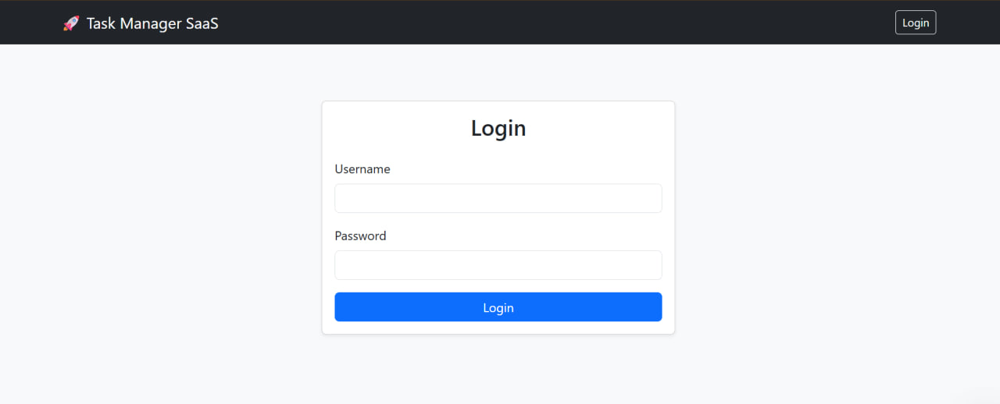
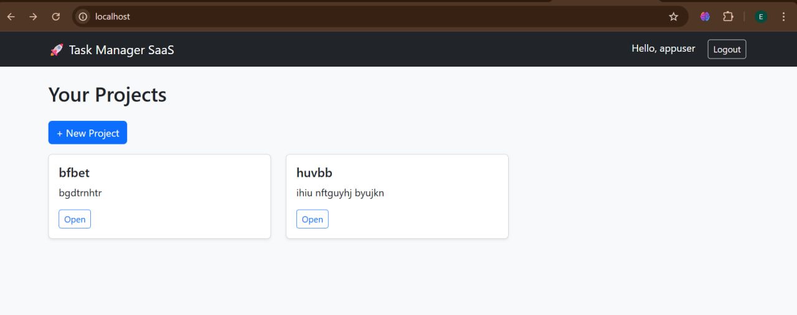
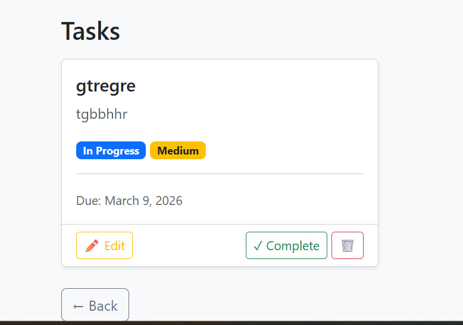
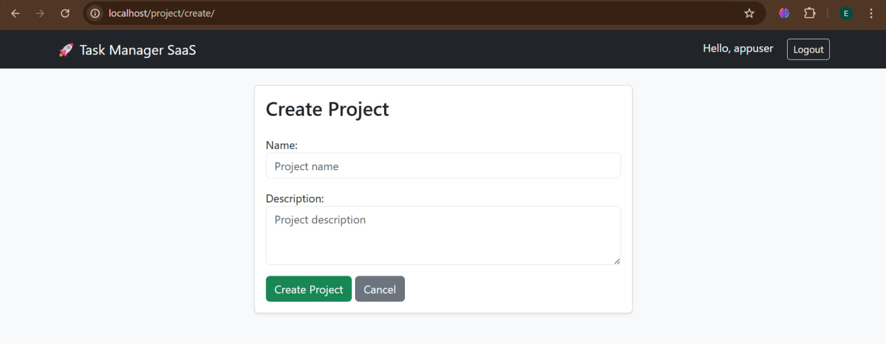
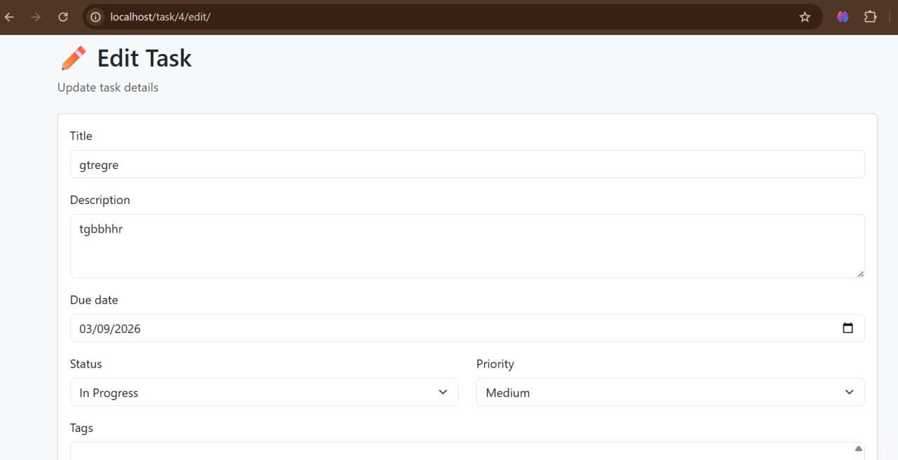

# Task Management System

A production-ready Django task management system using Docker, PostgreSQL, Gunicorn, and Nginx.

## Features
- Create tasks
- Update tasks
- Delete tasks
- Mark tasks as completed

## Technologies Used

- Python
- Django
- PostgreSQL
- Docker
- Docker Compose
- Gunicorn
- Nginx

## Local Setup Instructions

1. Clone the repository:
   git clone https://github.com/elnorailyosjonovna-lgtm/task-management-system.git

2. Build and start containers:
   docker compose up --build

3. Open in browser:
   http://localhost

## Environment Variables

The project uses a .env file with the following variables:

- SECRET_KEY
- DEBUG
- POSTGRES_DB
- POSTGRES_USER
- POSTGRES_PASSWORD
- POSTGRES_HOST
- POSTGRES_PORT

## Deployment Instructions

The project is configured for production using:

- Gunicorn as WSGI server
- Nginx as reverse proxy
- Docker multi-container architecture

## Application Screenshots

### Login Page

### Home Page

### Task List

### Create Task

### Edit Task

## Security

- Environment variables are not committed.
- Sensitive data is stored in .env file.
- Production configuration uses Gunicorn and Nginx.